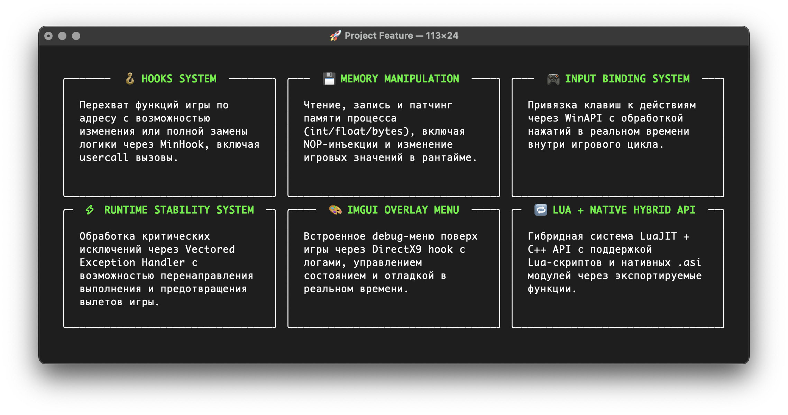

<div align="center">
  <h1>⚔️ RafLoader (Rise and Fall: Civilization at War)</h1>
  
</div>

RafLoader is a lightweight loader designed for **Rise and Fall: Civilization at War**, enabling runtime modifications and enhancements through LuaJIT and C++.

---

## 🚀 Overview

RafLoader injects into the game process to:

- Hook internal functions using **MinHook**.
- Initialize a LuaJIT environment.
- Intercept rendering via DirectX9.
- Execute user-defined scripts.
- Display a debug UI overlay.

---

## 🧩 Key Features

### 🪝 Function Hooks

- Intercept and modify game logic.
- Support for non-standard calls (usercall).
- Implemented using **MinHook** for efficient hooking.

### 💾 Memory Management

- Read and modify in-game values dynamically.
- Patch game code without recompilation.
- Manage memory protection using `VirtualProtect`.


### 🛡️ Crash Handling

- Recover from `EXCEPTION_ACCESS_VIOLATION` errors.
- Implement recovery points to prevent crashes and ensure stability.

### 🎨 Debug Overlay

- Built-in debug menu using **ImGui**.
- Display logs and toggle UI with **F1**.
- Works seamlessly over the game interface.

### 🔁 Tick System

- Execute user-defined code every frame.
- Ideal for implementing mod logic and updates.

### 📂 Lua Script Loader

- Automatically loads Lua scripts from the `scripts` folder.
- Supports modular script organization.
- Example structure:

  ```lua
  -- Example script in `scripts` folder
  local memory = _G.Engine.Memory

  print("Applying NOP")
  memory.write_nop(0x401000, 5)
  ```

---

## 🛠️ Example Usage

Here’s a complete example demonstrating RafLoader’s capabilities:

```lua
local memory = _G.Engine.Memory
local hooks  = _G.Engine.Hooks
local crash  = _G.Engine.VahCrash

print("Applying NOP")
memory.write_nop(0x401000, 5)

-- Hook a function
local original
original = hooks.create(0x401000, "int (__cdecl *NAME)(int)", function(a)
    print("Hooked:", a)
    return original(a)
end)

-- Set up crash recovery
crash.catch(0x403000, 0x404000)
```

This example demonstrates how to bind keys, hook functions, and handle crashes effectively using RafLoader.

---

## 🧱 Extensibility

- Use the API in Lua or C++.
- Write custom `.asi` plugins.
- Combine Lua scripting with native code for modular systems.

---

## ⚠️ Limitations

- Targeted for **x86** architecture.
- UI limited to **DirectX9**.
- Requires knowledge of memory addresses.
- Hooking errors may cause crashes.

---

RafLoader simplifies modding and debugging, offering a powerful toolkit for developers and enthusiasts.
